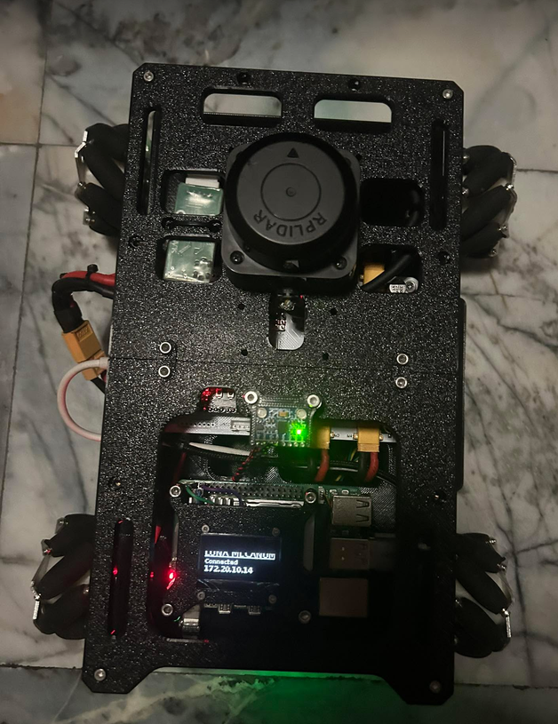
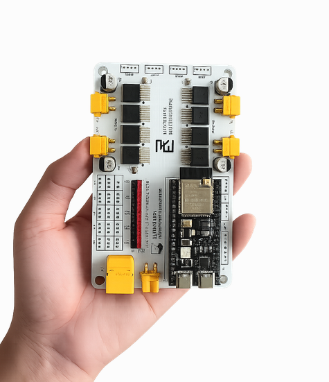
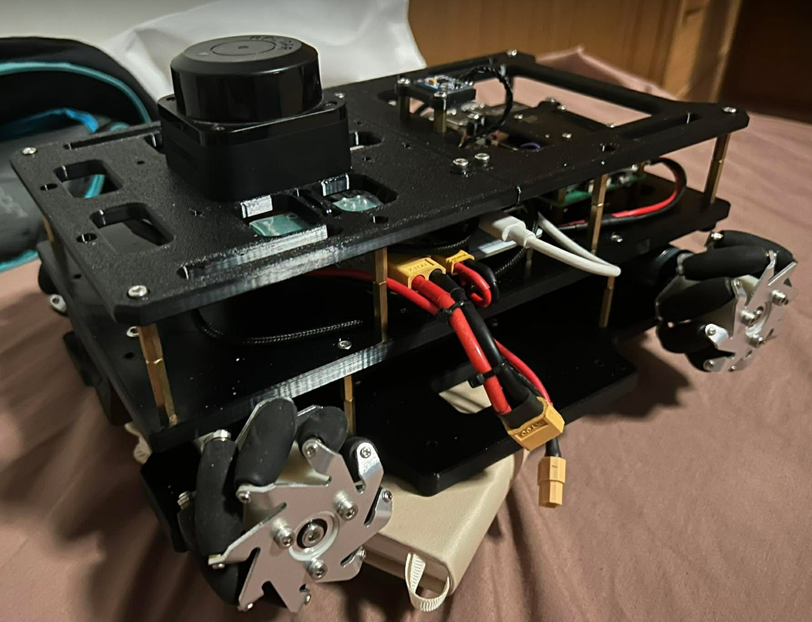
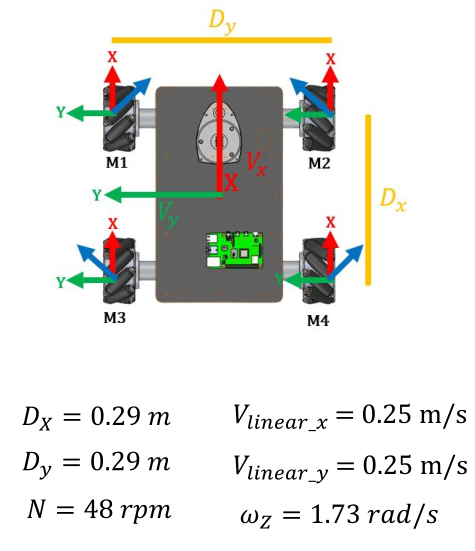
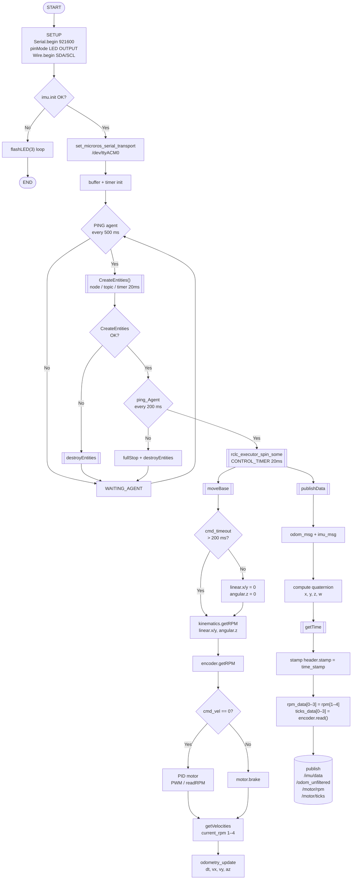

# LUNA Hardware Firmware

Firmware สำหรับ LUNA Mecanum Robot รันบน ESP32-S3 ใช้ micro-ROS ในการสื่อสารกับ ROS 2



### System Overview


---

## โครงสร้างโปรเจกต์

```
LUNA_BOT/
├── config/
│   ├── luna_robot.h          # config สำหรับ LUNA robot (ESP32-S3, LUNA Motor Driver)
│   ├── lulu_robot.h          # config สำหรับ LULU robot (ESP32, Cytron MD10C)
│   └── custom_robot.h        # config สำหรับ robot ที่กำหนดเอง
├── main/
│   ├── platformio.ini        # config สำหรับ firmware หลัก
│   ├── src/
│   │   └── firmware.ino      # firmware หลัก (micro-ROS publisher/subscriber)
│   └── lib/
│       ├── encoder/          # อ่านค่า encoder
│       ├── imu/              # driver MPU6050
│       ├── kinematics/       # คำนวณ mecanum kinematics
│       ├── motor/            # driver มอเตอร์ (LUNA_MOTOR_DRIVE)
│       ├── odometry/         # คำนวณ odometry
│       └── pid/              # PID controller
```

---

## 1. ติดตั้ง PlatformIO

### วิธีที่ 1 — VS Code Extension (แนะนำ)

1. ติดตั้ง [Visual Studio Code](https://code.visualstudio.com/)
2. เปิด VS Code → ไปที่ Extensions (`Ctrl+Shift+X`)
3. ค้นหา **PlatformIO IDE** แล้วกด Install
4. รอ PlatformIO Core ติดตั้งเสร็จ (ประมาณ 2–5 นาที) แล้ว Reload window

### วิธีที่ 2 — Command Line (Linux/macOS)

```bash
sudo apt install pipx
pipx ensurepath
pip install platformio
```

ตรวจสอบว่าติดตั้งสำเร็จ:

```bash
pio --version
```

### วิธีที่ 3 — Python Script (แนะนำสำหรับ Linux headless)

```bash
curl -fsSL https://raw.githubusercontent.com/platformio/platformio-core-installer/master/get-platformio.py -o get-platformio.py && python3 get-platformio.py
```

เพิ่ม PlatformIO เข้า PATH:

```bash
echo "PATH=\"\$PATH:\$HOME/.platformio/penv/bin\"" >> $HOME/.bashrc
source $HOME/.bashrc
```

### ติดตั้ง udev rules (Linux เท่านั้น)

ให้สิทธิ์เชื่อมต่อ USB โดยไม่ต้อง sudo:

```bash
curl -fsSL https://raw.githubusercontent.com/platformio/platformio-core/develop/platformio/assets/system/99-platformio-udev.rules | sudo tee /etc/udev/rules.d/99-platformio-udev.rules
sudo udevadm control --reload-rules
sudo usermod -aG dialout $USER
sudo usermod -aG plugdev $USER
```

> หลังรันคำสั่งนี้ต้อง **logout แล้ว login ใหม่** หรือ reboot

---

## 2. ติดตั้ง Micro-ROS Agent (บน PC)

Micro-ROS Agent ทำหน้าที่เป็นตัวกลางระหว่าง ESP32 กับ ROS 2

> ต้องติดตั้ง **ROS 2 Humble** ก่อน ดูได้ที่ https://docs.ros.org/en/humble/Installation.html

### ขั้นตอนที่ 1 — Source สภาพแวดล้อมของ ROS 2

```bash
source /opt/ros/$ROS_DISTRO/setup.bash
```

### ขั้นตอนที่ 2 — สร้าง Workspace และดาวน์โหลดเครื่องมือ micro-ROS

```bash
mkdir microros_ws
cd microros_ws

git clone -b $ROS_DISTRO \
  https://github.com/micro-ROS/micro_ros_setup.git \
  src/micro_ros_setup
```

### ขั้นตอนที่ 3 — อัปเดต Dependencies ด้วย rosdep

```bash
sudo apt update && rosdep update
rosdep install --from-paths src --ignore-src -y
```

### ขั้นตอนที่ 4 — ติดตั้ง pip สำหรับ Python

```bash
sudo apt-get install python3-pip
```

### ขั้นตอนที่ 5 — Build เครื่องมือ micro-ROS

```bash
colcon build
```

### ขั้นตอนที่ 6 — Source Workspace ที่ Build แล้ว

```bash
source install/local_setup.bash
```

---

### การสร้าง micro-ROS Agent

#### 1. สร้าง Workspace สำหรับ micro-ROS Agent

```bash
ros2 run micro_ros_setup create_agent_ws.sh
```

#### 2. Build micro-ROS Agent

```bash
ros2 run micro_ros_setup build_agent.sh
```

#### 3. Source Workspace

```bash
source install/local_setup.bash
```

#### 4. เพิ่มการ Source อัตโนมัติใน `.bashrc` (ทางเลือก)

```bash
echo "source ~/microros_ws/install/local_setup.bash" >> ~/.bashrc
source ~/.bashrc
```

#### 5. รัน Agent ผ่าน Serial

```bash
ros2 run micro_ros_agent micro_ros_agent serial --dev /dev/ttyUSB0
```

> ดูรายละเอียดเพิ่มเติม: https://micro.ros.org/docs/tutorials/core/first_application_linux/

---

## 3. Clone โปรเจกต์

```bash
git clone https://github.com/s6602013620199-wq/microROS-mecanumwheel.git
cd microROS-mecanumwheel
```

---

## 4. เลือก Robot Configuration

โปรเจกต์รองรับ **3 หุ่นยนต์** ในไฟล์ firmware เดียวกัน เลือกได้ผ่าน PlatformIO environment

### ตารางเปรียบเทียบ

| | `luna_robot` | `lulu_robot` | `custom_robot` |
|---|---|---|---|
| **Config file** | `luna_robot.h` | `lulu_robot.h` | `custom_robot.h` |
| **ESP32 Board** | ESP32-S3 DevKit C1 | ESP32 Dev (30-pin) | ESP32 Dev (30-pin) |
| **USB Port** | `/dev/ttyACM0` | `/dev/ttyUSB0` | `/dev/ttyUSB0` |
| **Motor Driver** | LUNA Motor Driver | Cytron MD10C | LUNA Motor Driver |
| **Wheel Diameter** | 65 mm | 100 mm | กำหนดเอง |

### Build และ Upload แต่ละ Robot

```bash
cd main

# LUNA robot (ESP32-S3)
pio run -e luna_robot -t upload

# LULU robot (ESP32 + Cytron MD10C)
pio run -e lulu_robot -t upload

# Custom robot (แก้ config/custom_robot.h ก่อน)
pio run -e custom_robot -t upload

#เอาไว้อัพโหลดโค้ค สำหรับ esp32s3 ที่ใช้มอเตอร์ไดรฟ์ ประเภท pwm2อัน เช่น m1a m1b
pio run -e luna_robot -t upload

#เอาไว้เปิด ดู  monitor สำหรับการพิมคำสั่งใช้งาน
pio device monitor -e luna_robot
#พอตกราฟ pid 4motor
python3 plot_motors.py
```

หรือใน VS Code: คลิกที่ชื่อ environment ที่ status bar ด้านล่าง → เลือก environment ที่ต้องการ → กด Upload (→)

### วิธีแก้ config ของแต่ละ Robot

แก้ไขไฟล์ config ที่ตรงกับ environment ที่ใช้:

| Environment | ไฟล์ที่ต้องแก้ |
|---|---|
| `luna_robot` | `config/luna_robot.h` |
| `lulu_robot` | `config/lulu_robot.h` |
| `custom_robot` | `config/custom_robot.h` |

firmware จะ include config ที่ถูกต้องอัตโนมัติผ่าน build flag:

```cpp
// firmware.ino — ไม่ต้องแก้ไฟล์นี้
#ifdef LULU_ROBOT_CONFIG
    #include "lulu_robot.h"
#elif defined(CUSTOM_ROBOT_CONFIG)
    #include "custom_robot.h"
#else
    #include "luna_robot.h"   // default
#endif
```

---

## 4.1 ตั้งค่าหุ่นยนต์ (`config/luna_robot.h`)

ไฟล์นี้คือหัวใจของ config ทั้งหมด แก้ค่าให้ตรงกับฮาร์ดแวร์ก่อนอัพโหลด

**การเชื่อมต่อฮาร์ดแวร์ทั้งหมด:**


**บอร์ด LUNA:**



**มุมมองด้านข้าง:**



```cpp
// Hardware ที่ใช้
#define LUNA_MOTOR_DRIVER       // LUNA_DRIVER
#define IMU_MPU6050             // IMU MPU6050
#define LUNA_BASE MECANUM       // ประเภทฐานล้อ

// I2C pins
#define SDA_PIN 2
#define SCL_PIN 1

// PID gains สำหรับแต่ละมอเตอร์
#define K_P1 0.01
#define K_I1 1.0
#define K_D1 0

// ข้อมูลล้อและมอเตอร์
#define MOTOR_MAX_RPM           60      // RPM สูงสุดของมอเตอร์
#define WHEEL_DIAMETER          0.065   // เส้นผ่านศูนย์กลางล้อ (เมตร)
#define LR_WHEELS_DISTANCE      0.1975  // ระยะห่างระหว่างล้อซ้าย-ขวา (เมตร)

// Encoder counts per revolution (วัดจริงด้วยคำสั่ง sample)
#define COUNTS_PER_REV1 2250
#define COUNTS_PER_REV2 2102
#define COUNTS_PER_REV3 2276
#define COUNTS_PER_REV4 2139
```

**การจัดวางมอเตอร์:**
```
        FRONT
  MOTOR1    MOTOR2
  MOTOR3    MOTOR4
        BACK
```



---

## 5. Firmware หลัก (`main/`)

Firmware สำหรับใช้งานจริงกับ ROS 2 ผ่าน micro-ROS

### Firmware Flowchart



### Build และ Upload

**ใน VS Code:**
1. เปิดโฟลเดอร์ `main/` ด้วย PlatformIO
2. คลิก environment ที่ status bar ด้านล่าง → เลือก robot ที่ต้องการ
3. กดปุ่ม **Build** (✓) หรือ **Upload** (→)

**ใน Terminal:**
```bash
cd main
pio run -e luna_robot          # build LUNA (ESP32-S3)
pio run -e lulu_robot          # build LULU (ESP32)
pio run -e custom_robot        # build Custom (ESP32)

pio run -e luna_robot   -t upload   # upload LUNA
pio run -e lulu_robot   -t upload   # upload LULU
pio run -e custom_robot -t upload   # upload Custom
```

### Topics ที่ firmware หลัก Publish/Subscribe

| Topic | Type | ทิศทาง | คำอธิบาย |
|---|---|---|---|
| `cmd_vel` | `geometry_msgs/Twist` | Subscribe | รับคำสั่งความเร็ว |
| `odom/unfiltered` | `nav_msgs/Odometry` | Publish | ข้อมูล odometry |
| `imu/data` | `sensor_msgs/Imu` | Publish | ข้อมูล accelerometer + gyroscope |
| `motor/rpm` | `std_msgs/Float32MultiArray` | Publish | RPM ของมอเตอร์ทั้ง 4 |
| `motor/ticks` | `std_msgs/Int32MultiArray` | Publish | Encoder tick count สะสมของมอเตอร์ทั้ง 4 |

### เชื่อมต่อ micro-ROS Agent (บน PC)

```bash
# ติดตั้ง agent (ครั้งแรกครั้งเดียว) ดูคลิปนี้
https://youtu.be/F4KXbHpUiv4?si=xijBHGEX6vcmlbPy

# รัน agent — LUNA robot (ESP32-S3, ttyACM0)
ros2 run micro_ros_agent micro_ros_agent serial --dev /dev/ttyACM0 -b 921600

# รัน agent — LULU / Custom robot (ESP32, ttyUSB0)
ros2 run micro_ros_agent micro_ros_agent serial --dev /dev/ttyUSB0 -b 921600
```

---

## 6. ลำดับการ Setup หุ่นยนต์ครั้งแรก

```
1. ติดตั้ง PlatformIO
2. เลือก config file ที่ตรงกับหุ่นยนต์ของคุณ:
     LUNA  → config/luna_robot.h
     LULU  → config/lulu_robot.h
     อื่นๆ → config/custom_robot.h
3. แก้ config file ให้ตรงกับ pin และ hardware จริง
4. อัพเดทค่า COUNTS_PER_REV ใน config file ให้ตรงกับ encoder จริง
5. Upload main firmware ด้วย environment ที่ตรงกัน
6. รัน micro-ROS Agent บน PC แล้วตรวจสอบ topics ด้วย ros2 topic echo
```

---

## 7. แก้ปัญหาที่พบบ่อย

| ปัญหา | สาเหตุ | แนวทางแก้ |
|---|---|---|
| Upload ไม่ได้ — `Permission denied /dev/ttyACM0` | ยังไม่มีสิทธิ์ USB | รัน `sudo usermod -aG dialout $USER` แล้ว reboot |
| Upload ไม่ได้ — port ไม่เจอ (LUNA) | ยังไม่ได้กด Boot button | กดค้าง **BOOT** บน ESP32-S3 ตอนกด Upload |
| Upload ไม่ได้ — port ไม่เจอ (LULU/Custom) | USB-to-UART ไม่เจอ port | ตรวจว่า `/dev/ttyUSB0` มีอยู่ด้วย `ls /dev/ttyUSB*` |
| `imu` command พิมพ์ ERROR | สาย I2C ผิด หรือ address ผิด | ตรวจ SDA/SCL pin ใน config file ของหุ่นยนต์และตรวจสายต่อ |
| micro-ROS Agent ต่อไม่ได้ | port หรือ baud rate ไม่ตรง | LUNA ใช้ `/dev/ttyACM0`, LULU/Custom ใช้ `/dev/ttyUSB0` baud 921600 |
| Build error `#include errors` | library ยังไม่ได้ดาวน์โหลด | รัน `pio pkg install` หรือ Build ครั้งแรกรอสักครู่ |
| LED ไม่กะพริบหลัง upload | micro-ROS Agent ยังไม่ได้รัน | รัน agent บน PC ก่อน ESP32 จะเชื่อมต่อและ LED จะกะพริบ |
| มอเตอร์หมุนผิดทิศทาง | `MOTORX_INV` ผิด | แก้ค่า `MOTORX_INV true/false` ใน config file ของหุ่นยนต์ |
